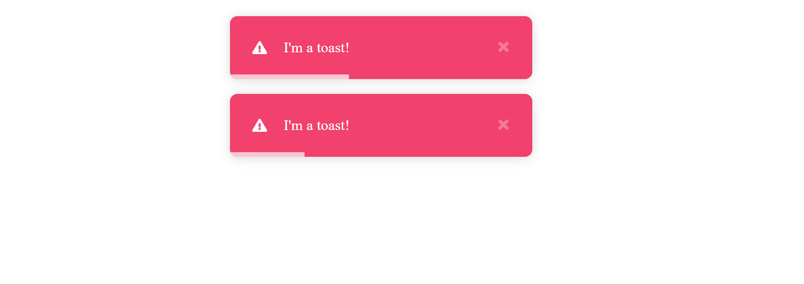

# Nice Toast JS 
## nice and easy toast for jquery

[](https://www.npmjs.com/package/nice-toast-js)



Requirements
-----
  + [jQuery](http://jquery.com/)


Installation
-----

### [NPM](https://www.npmjs.com/package/nice-toast-js)
```bash
npm install nice-toast-js
```

### [Yarn](https://yarn.pm/nice-toast-js)
```bash
yarn add nice-toast-js
```

### [CDN - jsDelivr](https://www.jsdelivr.com/package/npm/nice-toast-js)
```html
<!-- CSS -->
<link href="https://cdn.jsdelivr.net/npm/nice-toast-js/dist/css/nice-toast-js.min.css" rel="stylesheet" type="text/css" />

<!-- JavaScript -->
<script src="https://cdn.jsdelivr.net/npm/nice-toast-js/dist/js/nice-toast-js.min.js" type="text/javascript"></script>
```    

### [CDN - UNPKG](https://unpkg.com/browse/nice-toast-js/)
```html
<!-- CSS -->
<link href="https://unpkg.com/nice-toast-js/dist/css/nice-toast-js.min.css" rel="stylesheet" type="text/css" />

<!-- JavaScript -->
<script src="https://unpkg.com/nice-toast-js/dist/js/nice-toast-js.min.js" type="text/javascript"></script>
```

Usage
-----

Initialize the Plugin
```js
$.niceToast.setup({
    position: "top-center",
    timeout: 5000,
});

```
New toast
```js
$('button').click(function () {
    $.niceToast.error("I'm a toast!");
});
```

License
----
MIT
